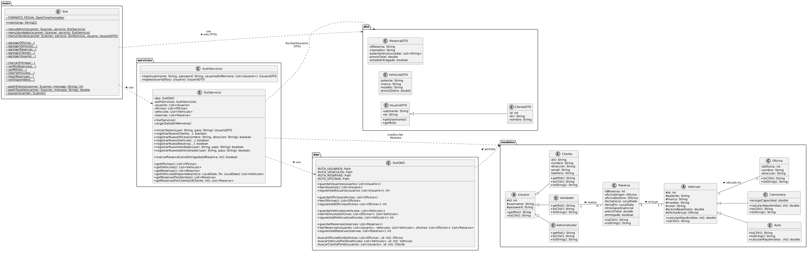

# Sistema de Gestión de Reservas - Sixt (TP)

Sistema desarrollado en Java por consola para la gestión de vehículos, clientes y reservas, aplicando principios de Programación Orientada a Objetos (Herencia, Polimorfismo, Encapsulamiento) y persistencia de datos mediante `java.nio`.

## 📊 Arquitectura y Modelado (UML)

A continuación se detalla el Diagrama de Clases del dominio, incluyendo el patrón DTO para la transferencia de datos.

*(El código fuente PlantUML se encuentra en `docs/uml.txt`)*

---

## 🗺️ Hoja de Ruta del Equipo (Sprints)

- [x] **Sprint 1: Las Bases (Modelos)**
  - Creación de clases en el paquete `modelos`.
  - Implementación de Herencia en Usuarios y Polimorfismo en Vehículos.
  - Creación de constructores, getters, setters y método `toCSV()`.
- [x] **Sprint 2: Atributos de clases que vamos a guardar/mostrar (DTO)**
  - Creación de clases dto en el paquete `dto` para aislar la información sensible.
- [x] **Sprint 3: El Almacenamiento (DAO)**
  - Lectura y escritura de archivos `.txt` utilizando `java.nio`.
  - Implementación completa de persistencia para Vehículos, Oficinas, Reservas y Usuarios.
  - Resolución de conflictos de lectura de índices y formateo estricto por delimitador (`,`).
- [x] **Sprint 4: El Cerebro (Servicios)**
  - Implementación de la lógica de negocio (`AuthServicios` y `SixtServicio`).
  - Lógica de cálculo de precios dinámicos según el tipo de vehículo.
  - Gestión de memoria y carga relacional (`cargarDatosEnMemoria()`) recreando las referencias entre objetos.
  - Algoritmo de filtrado por fechas cruzadas para obtener vehículos disponibles.
- [x] **Sprint 5: La Pantalla (Main y Consola) y Experiencia de Usuario (UX)**
  - Desarrollo de menús interactivos por roles (Admin, Vendedor, Cliente).
  - Implementación de "Escudos de Teclado" (`pedirEntero`, `pedirDouble`) para evitar crasheos por `NumberFormatException`.
  - Aplicación de principios UX: *Fail Fast* (validación instantánea de IDs), manejo de *Empty States* (listas vacías) y *Feedback Desglosado* para los errores operativos.
- [x] **Sprint 6: Entregables Finales**
  - Generación de Javadoc y compilación del `.jar` final.